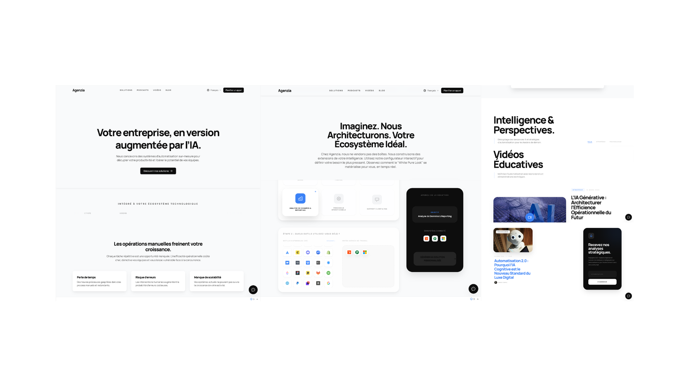

#  Agenzia TXT - Agence Créative & Stratégie Digitale

[](https://github.com/votre-nom/agenzia-txt)
[](https://opensource.org/licenses/MIT)
[](https://tailwindcss.com)

**Agenzia TXT** est une landing page moderne et performante conçue pour les agences de communication, les créatifs et les experts SEO. Le projet met l'accent sur la clarté du message, une esthétique épurée (Clean UI) et une intégration native des nouveaux standards du web.

---

##  Aperçu du Projet

Voici un aperçu de l'interface principale, incluant la **Hero Section** et la **Grille des Services**. 
*(Remplacez le fichier dans `assets/dashboard.png` pour mettre à jour cette vue).*

<p align="center">
  
  <br>
  <em>Design minimaliste : Typographie forte, navigation fluide et mise en avant des compétences clés.</em>
</p>

---

##  Caractéristiques Principales

- **Design Moderne & Épuré** : Une interface professionnelle avec un support complet du mode sombre.
- **Hero Section Impactante** : Conçue pour convertir les visiteurs avec un message clair et des appels à l'action (CTA) stratégiques.
- **Grille de Services Dynamique** : Présentation élégante de vos expertises (Content Strategy, Web Dev, AI Integration).
- **IA-Ready** : Intégration du standard `agents.txt` pour permettre aux agents d'IA de comprendre et d'interagir avec votre agence (Business-to-Agent).
- **Performance Optimisée** : Code léger garantissant un score Lighthouse supérieur à 90 pour un meilleur référencement SEO.

##  Technologies Utilisées

- **Frontend** : HTML5, CSS3 (Tailwind CSS pour un design responsive et rapide).
- **Interactivité** : JavaScript (ES6+) pour les animations fluides et la gestion des formulaires.
- **Typographie** : Google Fonts (Montserrat & Inter) pour une lisibilité maximale.

##  Installation et Lancement

Pour explorer ou modifier le projet localement :

1. **Cloner le repository** :
   ```bash
   git clone https://github.com/votre-nom/agenzia.git

Accéder au dossier :

code
Bash
download
content_copy
expand_less
cd agenzia-txt

Ouvrir le projet :

Double-cliquez sur index.html ou utilisez l'extension Live Server sur VS Code pour un rechargement automatique.

 Structure des Fichiers
code
Text
download
content_copy
expand_less
agenzia-txt/
├── assets/             # Images, icônes et dashboard.png
├── css/                # Feuilles de style (Tailwind / Custom CSS)
├── js/                 # Logique interactive et animations
├── index.html          # Page d'accueil (Hero & Services)
├── agents.txt          # Configuration pour les agents IA
└── README.md           # Documentation du projet
🤝 Contribuer

Les propositions d'amélioration sont les bienvenues !

Forkez le projet.

Créez une branche de fonctionnalité (git checkout -b feature/NomDeLaFeature).

Soumettez une Pull Request après avoir testé vos modifications.

⭐ Si ce projet vous inspire, n'oubliez pas de lui donner une étoile sur GitHub !

code
Code
download
content_copy
expand_less
---
